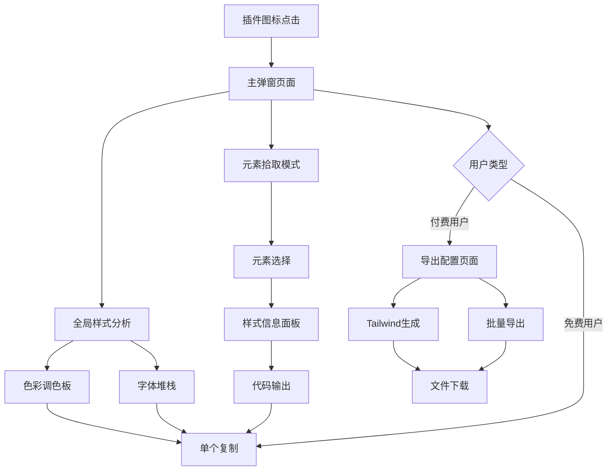

# CSS Master: 样式提取器 产品需求文档

## 1. 产品概述

CSS Master 是一款为设计师和前端开发者打造的浏览器插件，用于一键分析网页的视觉设计风格（色彩、字体），并能够提取任意元素的样式代码，同时支持导出为现代开发工作流（如Tailwind CSS）的配置格式。产品旨在省时、精准、智能地提升设计和开发工作流效率，为用户提供愉悦、直观的使用体验。

## 2. 核心功能

### 2.1 用户角色

| 角色 | 注册方式 | 核心权限 |
|------|----------|----------|
| 免费用户 | 浏览器插件安装 | 基础样式提取、单个复制功能 |
| 付费用户 | 升级订阅 | 批量导出、Tailwind配置生成、AI增强功能 |

### 2.2 功能模块

我们的CSS样式提取器包含以下主要页面：

1. **主弹窗页面**：全局样式分析、色彩调色板、字体堆栈展示
2. **元素拾取页面**：元素选择器、详细样式信息、代码输出
3. **导出配置页面**：导出选项、格式选择、批量处理
4. **设置页面**：用户偏好、付费功能管理、历史记录

### 2.3 页面详情

| 页面名称 | 模块名称 | 功能描述 |
|----------|----------|----------|
| 主弹窗页面 | 全局分析模块 | 扫描当前页面，提取5-8种主要颜色和3-5种字体家族，按使用频率排序展示 |
| 主弹窗页面 | 色彩调色板 | 以色块网格形式展示提取的颜色，支持HEX、RGB、HSL格式切换和一键复制 |
| 主弹窗页面 | 字体堆栈 | 显示页面主要字体家族，包含字重、字号信息，支持复制字体CSS声明 |
| 元素拾取页面 | 拾取模式 | 激活元素选择器，页面进入遮罩模式，光标变为十字准星，支持精确元素定位 |
| 元素拾取页面 | 样式信息面板 | 显示选中元素的尺寸、间距、颜色、字体等详细样式信息 |
| 元素拾取页面 | 代码输出 | 提供原始CSS和Tailwind CSS两种格式的代码输出，支持语法高亮和复制 |
| 导出配置页面 | Tailwind生成器 | 将全局样式转换为标准tailwind.config.js文件格式，支持自定义配置 |
| 导出配置页面 | 批量导出 | 一键导出所有颜色或字体信息，支持多种格式（JSON、CSS、JS） |
| 导出配置页面 | 文件下载 | 生成配置文件并触发浏览器下载，支持自定义文件名 |
| 设置页面 | 用户偏好 | 配置默认导出格式、AI增强开关、自动保存等选项 |
| 设置页面 | 历史记录 | 查看和管理之前的分析结果，支持收藏和删除操作 |
| 设置页面 | 付费管理 | 订阅状态查看、功能升级、账单管理 |

## 3. 核心流程

**免费用户流程：**
用户安装插件后，点击插件图标打开主弹窗，查看当前页面的全局样式分析结果。用户可以激活元素拾取模式，点击页面元素查看详细样式信息，并复制单个样式值到剪贴板。

**付费用户流程：**
付费用户除了享有免费功能外，还可以使用批量导出功能，一键生成Tailwind配置文件，使用AI增强的智能命名和样式优化建议，以及访问历史记录和高级设置选项。

## 4. 用户界面设计

### 4.1 设计风格

- **主色调**：#3B82F6（蓝色）作为主色，#1E293B（深灰）作为辅助色
- **按钮样式**：圆角按钮设计，采用微妙的阴影和悬停效果
- **字体**：Inter字体家族，主要字号16px，标题18px，小字号14px
- **布局风格**：卡片式布局，顶部标签导航，简洁的网格系统
- **图标风格**：使用Heroicons图标库，线性风格，保持一致性

### 4.2 页面设计概览

| 页面名称 | 模块名称 | UI元素 |
|----------|----------|--------|
| 主弹窗页面 | 全局分析模块 | 400x500px弹窗，顶部标签导航，加载动画，3秒内完成分析显示 |
| 主弹窗页面 | 色彩调色板 | 4x2网格布局色块，每个色块显示HEX值，悬停显示RGB/HSL，复制图标 |
| 主弹窗页面 | 字体堆栈 | 垂直列表布局，字体名称+预览文本，字重和字号标签，复制按钮 |
| 元素拾取页面 | 拾取模式 | 全屏遮罩层，十字准星光标，选中元素高亮边框，取消按钮 |
| 元素拾取页面 | 样式信息面板 | 分组展示样式属性，标签式布局，数值高亮显示，单位自动识别 |
| 导出配置页面 | Tailwind生成器 | 代码预览区域，语法高亮，配置选项面板，生成按钮 |
| 设置页面 | 用户偏好 | 开关组件，下拉选择器，滑块控件，保存提示 |

### 4.3 响应性设计

产品采用桌面优先设计，针对浏览器插件的固定尺寸进行优化。界面支持键盘导航和无障碍访问，包含适当的ARIA标签和焦点管理。所有交互都提供清晰的视觉反馈，如复制成功的Toast提示、按钮悬停效果和加载状态指示。