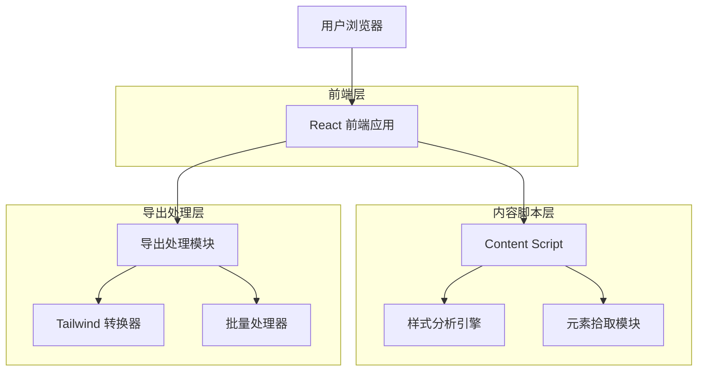
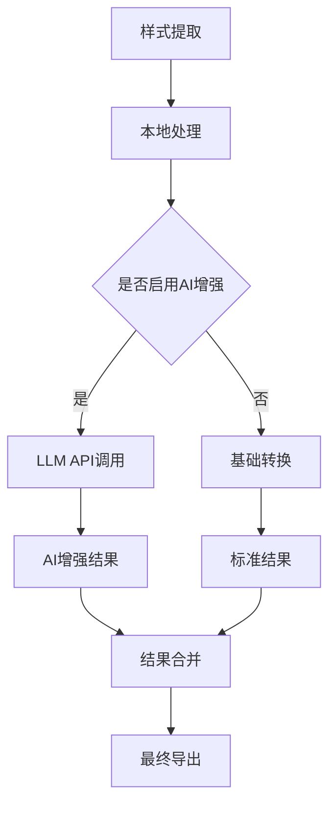
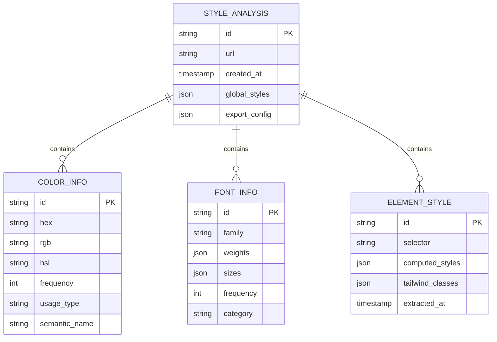

# CSS Master 样式提取器 - 技术开发文档

## 1. 架构设计



## 2. 技术描述

- 前端：React@18 + Tailwind CSS@3 + Vite
- 浏览器插件：Manifest V3
- 样式处理：原生 JavaScript + CSS-to-Tailwind 转换库
- 构建工具：Vite + Chrome Extension Plugin

## 3. 路由定义

| 路由 | 用途 |
|------|------|
| /popup | 主弹窗页面，显示全局样式分析和导出功能 |
| /options | 设置页面，配置导出选项和付费功能 |
| /element-picker | 元素拾取模式界面 |

## 4. 核心模块设计

### 4.1 样式分析引擎

```typescript
interface StyleAnalyzer {
  analyzeGlobalStyles(): Promise<GlobalStylesResult>;
  getElementStyles(element: HTMLElement): ElementStylesResult;
  extractColorPalette(): ColorPalette;
  extractFontFamilies(): FontFamily[];
}

interface GlobalStylesResult {
  colors: ColorInfo[];
  fonts: FontInfo[];
  analysisTime: number;
}

interface ColorInfo {
  hex: string;
  rgb: string;
  hsl: string;
  frequency: number;
  usage: 'background' | 'text' | 'border' | 'accent';
}

interface FontInfo {
  family: string;
  weights: number[];
  sizes: string[];
  frequency: number;
}
```

### 4.2 导出模块详细设计

#### 4.2.1 核心导出接口

```typescript
interface ExportModule {
  // 基础复制功能
  copyToClipboard(content: string): Promise<boolean>;
  
  // Tailwind 配置导出
  exportTailwindConfig(styles: GlobalStylesResult): Promise<string>;
  
  // 批量导出功能
  batchExportColors(colors: ColorInfo[]): Promise<string>;
  batchExportFonts(fonts: FontInfo[]): Promise<string>;
  
  // 文件导出
  downloadAsFile(content: string, filename: string, type: 'js' | 'json' | 'css'): void;
}
```

#### 4.2.2 Tailwind 配置生成器

```typescript
class TailwindConfigGenerator {
  private colorMapping: Map<string, string> = new Map();
  private fontMapping: Map<string, string> = new Map();
  
  generateConfig(styles: GlobalStylesResult): TailwindConfig {
    return {
      theme: {
        extend: {
          colors: this.generateColorConfig(styles.colors),
          fontFamily: this.generateFontConfig(styles.fonts),
          fontSize: this.generateFontSizeConfig(styles.fonts)
        }
      }
    };
  }
  
  private generateColorConfig(colors: ColorInfo[]): Record<string, string> {
    const config: Record<string, string> = {};
    
    colors.forEach((color, index) => {
      const name = this.generateColorName(color, index);
      config[name] = color.hex;
    });
    
    return config;
  }
  
  private generateColorName(color: ColorInfo, index: number): string {
    // 智能命名逻辑
    const baseNames = {
      'background': 'bg',
      'text': 'text',
      'border': 'border',
      'accent': 'accent'
    };
    
    return `${baseNames[color.usage] || 'custom'}-${index + 1}`;
  }
}
```

#### 4.2.3 CSS 到 Tailwind 转换器

```typescript
class CSSToTailwindConverter {
  private conversionRules: Map<string, (value: string) => string> = new Map();
  
  constructor() {
    this.initializeConversionRules();
  }
  
  convert(cssProperty: string, cssValue: string): string {
    const converter = this.conversionRules.get(cssProperty);
    return converter ? converter(cssValue) : `[${cssProperty}:${cssValue}]`;
  }
  
  private initializeConversionRules(): void {
    // 字体大小转换
    this.conversionRules.set('font-size', (value: string) => {
      const sizeMap: Record<string, string> = {
        '12px': 'text-xs',
        '14px': 'text-sm',
        '16px': 'text-base',
        '18px': 'text-lg',
        '20px': 'text-xl',
        '24px': 'text-2xl',
        '30px': 'text-3xl',
        '36px': 'text-4xl'
      };
      return sizeMap[value] || `text-[${value}]`;
    });
    
    // 颜色转换
    this.conversionRules.set('color', (value: string) => {
      return `text-[${value}]`;
    });
    
    // 背景色转换
    this.conversionRules.set('background-color', (value: string) => {
      return `bg-[${value}]`;
    });
    
    // 边距转换
    this.conversionRules.set('margin', (value: string) => {
      const spacingMap: Record<string, string> = {
        '4px': 'm-1',
        '8px': 'm-2',
        '12px': 'm-3',
        '16px': 'm-4',
        '20px': 'm-5',
        '24px': 'm-6'
      };
      return spacingMap[value] || `m-[${value}]`;
    });
  }
}
```

### 4.3 是否需要大模型集成

#### 4.3.1 大模型应用场景分析

**推荐集成大模型的场景：**

1. **智能样式命名**：使用 LLM 为提取的颜色和样式生成语义化名称
2. **复杂样式转换**：处理复杂的 CSS 组合转换为 Tailwind 类
3. **设计系统建议**：基于提取的样式提供设计系统优化建议
4. **样式语义分析**：理解样式的设计意图和用途

#### 4.3.2 大模型集成方案

```typescript
interface LLMService {
  generateColorNames(colors: ColorInfo[]): Promise<string[]>;
  optimizeTailwindConfig(config: TailwindConfig): Promise<TailwindConfig>;
  analyzeDesignPatterns(styles: GlobalStylesResult): Promise<DesignInsights>;
}

class OpenAIStyleAnalyzer implements LLMService {
  private apiKey: string;
  
  async generateColorNames(colors: ColorInfo[]): Promise<string[]> {
    const prompt = `
      基于以下颜色信息，为每个颜色生成语义化的名称：
      ${colors.map(c => `${c.hex} (用途: ${c.usage})`).join('\n')}
      
      要求：
      1. 名称要简洁且具有描述性
      2. 符合设计系统命名规范
      3. 避免使用过于具体的颜色名称
    `;
    
    const response = await this.callOpenAI(prompt);
    return this.parseColorNames(response);
  }
  
  async optimizeTailwindConfig(config: TailwindConfig): Promise<TailwindConfig> {
    const prompt = `
      优化以下 Tailwind CSS 配置，提供更好的设计系统结构：
      ${JSON.stringify(config, null, 2)}
      
      优化目标：
      1. 创建一致的颜色层次
      2. 优化字体大小比例
      3. 提供合理的间距系统
    `;
    
    const response = await this.callOpenAI(prompt);
    return JSON.parse(response);
  }
}
```

#### 4.3.3 大模型集成的技术架构



**实现建议：**

1. **可选集成**：大模型功能作为付费增值服务
2. **本地优先**：基础功能不依赖外部 API
3. **缓存机制**：对常见样式转换结果进行缓存
4. **降级处理**：API 失败时回退到本地处理

## 5. 数据模型

### 5.1 数据模型定义



### 5.2 本地存储结构

```typescript
// Chrome Extension Storage
interface StorageSchema {
  // 用户设置
  userSettings: {
    exportFormat: 'tailwind' | 'css' | 'json';
    aiEnhanced: boolean;
    autoSave: boolean;
  };
  
  // 分析历史
  analysisHistory: StyleAnalysis[];
  
  // 导出模板
  exportTemplates: ExportTemplate[];
  
  // 缓存数据
  conversionCache: Map<string, string>;
}
```

## 6. 开发流程和里程碑

### 6.1 开发阶段规划

#### 阶段一：核心功能开发 (4-6周)

**里程碑 1.1：基础架构搭建 (1周)**
- [ ] 项目初始化和构建配置
- [ ] Manifest V3 配置
- [ ] React + Vite 开发环境
- [ ] 基础 UI 组件库

**里程碑 1.2：样式分析引擎 (2周)**
- [ ] 全局样式扫描算法
- [ ] 颜色提取和频率统计
- [ ] 字体家族分析
- [ ] 性能优化（3秒内完成分析）

**里程碑 1.3：元素拾取功能 (1周)**
- [ ] 元素选择器实现
- [ ] 样式信息提取
- [ ] 交互反馈和 UI

**里程碑 1.4：基础导出功能 (1-2周)**
- [ ] 剪贴板复制功能
- [ ] 基础 CSS 代码生成
- [ ] 简单的 Tailwind 转换

#### 阶段二：高级导出功能 (3-4周)

**里程碑 2.1：Tailwind 配置生成器 (2周)**
- [ ] 完整的 CSS-to-Tailwind 转换规则
- [ ] 智能配置文件生成
- [ ] 批量导出功能

**里程碑 2.2：大模型集成 (1-2周)**
- [ ] OpenAI API 集成
- [ ] 智能命名服务
- [ ] 样式优化建议
- [ ] 错误处理和降级

#### 阶段三：用户体验优化 (2-3周)

**里程碑 3.1：UI/UX 完善 (1-2周)**
- [ ] 响应式设计
- [ ] 动画和过渡效果
- [ ] 无障碍访问支持
- [ ] 多语言支持

**里程碑 3.2：性能和稳定性 (1周)**
- [ ] 内存优化
- [ ] 错误监控
- [ ] 单元测试覆盖
- [ ] 兼容性测试

### 6.2 技术实现优先级

**高优先级（MVP 必需）：**
1. 基础样式提取和分析
2. 简单的复制功能
3. 基本的 Tailwind 转换
4. 核心 UI 界面

**中优先级（V1.1 版本）：**
1. 完整的导出配置生成
2. 批量处理功能
3. 本地存储和历史记录

**低优先级（V2.0 版本）：**
1. 大模型集成
2. 高级样式分析
3. 设计系统建议
4. 团队协作功能

### 6.3 关键技术决策

1. **大模型集成时机**：建议在 V1.1 版本后集成，作为付费增值功能
2. **性能优化策略**：使用 Web Workers 处理大量样式分析
3. **缓存策略**：本地缓存常用转换结果，减少重复计算
4. **错误处理**：完善的降级机制，确保基础功能始终可用

## 7. 部署和发布

### 7.1 构建配置

```javascript
// vite.config.js
import { defineConfig } from 'vite';
import react from '@vitejs/plugin-react';
import { crx } from '@crxjs/vite-plugin';
import manifest from './manifest.json';

export default defineConfig({
  plugins: [
    react(),
    crx({ manifest })
  ],
  build: {
    rollupOptions: {
      input: {
        popup: 'src/popup/index.html',
        options: 'src/options/index.html',
        content: 'src/content/index.ts',
        background: 'src/background/index.ts'
      }
    }
  }
});
```

### 7.2 发布流程

1. **开发环境测试**
2. **Chrome Web Store 开发者账号申请**
3. **应用图标和截图准备**
4. **隐私政策和用户协议**
5. **分阶段发布（Beta → 正式版）**

这份技术文档为 CSS Master 样式提取器的开发提供了完整的技术指导，特别是在导出模块的实现上提供了详细的方案。大模型的集成建议作为增值功能在后续版本中实现，以平衡功能复杂度和开发成本。